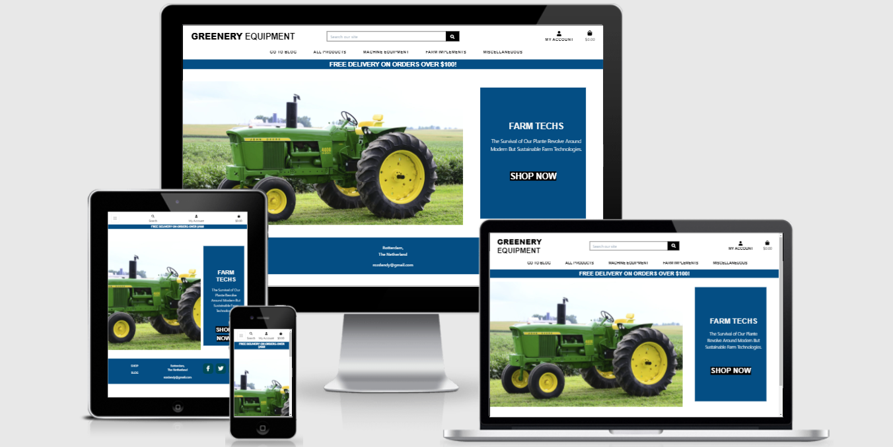

### **Website links:** 
*my github link*: [Rozdandy](https://github.com/Rozdandy/greenery_equipment)

*Website Link*:

[herokuApp](https://greenery-equipment.herokuapp.com/)

# Greenery Equipment
---
This project is online fictitious e-commerce store selling modern agricultural equipment in various categories, which provide farmers, government and investors to order online from the comfort of their homes, offices or farm yards. It also has the Blog section where users can read and comment on agricultural-climate change related news and posts.

# Project Summary
---
This is a Full Stack Frameworks with Django and other libraries, the project was made for Code Institute as MS4.

The website is an e-commerce shopping website. The store provides a distinct customer experience which includes some kind of user-friendly euphoria actions which afford individual customer of the website to review a particular product, view blog section and comment. The site also provide good responsive view for different devices and a well secured login, shopping and payment system.

The aim of the site is to allow the user to create an account and make a purchase of products with Stripe secure payment system and also have a taste of the latest news on climate change and agriculure. Most of the admin activities is built on Django admin-allauth login integrated modules. The site also provides enabling user-friendly  tasks such as adding, editing and deleting products or blog posts through the website User Interface.

# UX 
 ----

 ## User Experience Design UX 
 ----

## The Strategy Plane

The site owner aimed to provide customer e-commerce services to purchase items and have them delivered to their homes. Also, to provide more user interactions among users in order to built trust and good customer-owner relationships, this will enable us in understanding complex consumer behaviour to maximise conversion rates. The blog, comment and product review sections were created for this purpose but only for registered users.

 ### Main Objective:
 * To sell and promotes  online products.
 * To develope relevant targets
 * To generate revenue and provide a distincts customer experience
 * To establish brand awareness and corporate identity.
 * To know customers thought and feelings about a particular products and our services, through comment and reviews.

 ### User Stories
 ----

 The following User Stories were used to create the design that would meet the needs of several types of users which include ananymous user, regular and registered user, stakeholders and site owners.

 #### Site Users
| As A User  | I want to able to ...                                                                    | in order to...                                                                                                                                    |
|------------|----------------------------------------------------------------------------------------|-------------------------------------------------------------------------------------------------------------------------------------------------------|
| user       | easily register for my account,                                                        | have a personalized account to be able to view my profile, rate and review products                                            |
| user       | quick login / logout                                                                   | access my account and information                                                                                                                      |
| user       | enable easy password recovery, incase I cannot remember                                       | regain access to my account                                                                                                                           |
| user       | have a personalized user profile                                                       | save my default delivery details, payment, see past order history and confirmations                                                              |
| user       | receive email confirmation upon sign up or password rest                               | verify that my account registeration was successful|                                                                                                                                                       |
| user       | view products by category, rate or price                                               | Make a selection to buy                                                                                                          |
| user       | view individual product details                                                        | identify product ratings, price, full size image, size, color, description,  and various ratings if other users had previously bought the item rated  |
| user       | search products                                                                        | add to shopping bag or buy                                                                                                         |
| user       | promptly see the outcomes of searched items and the number of products available for the searches | know if the product I searched for is available                                                                                       |                                     |
| user       | readily view the total of items in my bag anytime to avoid excessive spenidng          | avoid over spending                                                                                                                            |
| user       | sort products by either categories or prices                                            | quickly find products based on the best prices and categories                                                                           |
| user       | easily add, subtract or delete products from my shopping bag                           | ensure I can easily keep to my budget                                                                                                                 |
| user       | easily view all selected products in my shopping bag to be bought                      | see the total cost and quantity                                                                                                                       |
| user       | readily render payment with my card at checkout                                        | checkout easy                                                                                                                                         |
| user       | have confident for the security of payment process and my card details are secured     | provide the necessary info to complete the payment                                                                                        |
| user       | can readily view the order details after checkout is successful                        |  have a verified receipt of my purchase                                                                                                                |
| user       | have a confirmation email with the details of my purchase                           | have a copy of my confirmation                                                                                                                     |
| user       | have a confirmation email with the details of my purchase                           | have a copy of my confirmation                                                 
| user       | able to contact store owners                                                        | resolve any purchase or other issues I might encounter 
| user       | able to view latest post at the blog post                                           | be informed on latest climate change and agricultural related news
| site-owner | add products                                                                        | for users to see products and to be sold on my site                                                                                                                    |
| site-owner | edit / update products                                                              | easily make changes to any product attribute eg name, prices or descriptions                                                                        |
| site-owner | delete product                                                                      | easily remove product from the site.                                                                                                               |
| user       | have a confirmation email with the details of my purchase                           | have a copy of my confirmation                                                                                                                     |
| site-owner | add products                                                                        | for users to see products and to be sold on my site                                                                                                                    |
| site-owner | edit / update products                                                              | easily make changes to any product attribute eg name, prices or descriptions                                                                        |
| site-owner | delete product                                                                      | easily remove product from the site.                                                                                                               |
| site-owner | add, edit and amend blog post when necessary                                        | maintain and coordinate the serenity of the sites.

## The Scope Plane 

Covid-19 is a game-changer, a hallmark of our present dispensation. Online shopping and sales has risen drasticallly in the last 2 years and this trend will continue for a while especially with globalisation. Thus the aim here is to build user-friendly website that is intuitive and easy to navigate.

### Intended Features include:

* Responsive design.
* Intuitive and easy navigable website.
* Mobile and desktop navigations.
* Standard e-commerce feed of products with the option to sort products and filter them by price and category names. 
* Every product details could be viewed by just clicking on it.
* Blog post to inspire users, so that can be coming back for me.
* To enable customers to leave a review on a particualr product.
* Contact information to easily contact the store owner.

 ## The Skeleton Plane

 ### **Security**

The Heroku config variables to store all SECRET keys safely to prevent unwanted connections to the database.

Django allauth was used to set up user registration and built in decorators allowed restricted access to certain features on the website that are not meant for regular users.

### **Wireframe**

 [Balsamiq App](https://balsamiq.com/) was used for the design architechture and the site mockups. Below is the link to the wireframe for the desktop and mobile device.

**View all**

 * [Wireframe](wireframe/ms4_wireframe.pdf))

### **Database Design**

By default, Django works with SQL databases , thus the SQLite was used during the development. However, Heroku provides a PostgreSQL database for the deployment.

**View all**

 * [Database Schemer](test/schematic.png)

## The Surface Plane

#### Fonts

[Google Fonts!](https://fonts.googleapis.com/css2?family=Berkshire+Swash&family=Dancing+Script:wght@500&family=Exo+2:wght@300&display=swap) Three main fonts were used for the whole sites:

* Exo+2: for the body with fall back on cursive.
* Berkshire+Swash&family: for the headers with fall back on cursive.
* Dancing+Script: for headers mute message and fall back on cursive.

#### **Colour Scheme**

The developer used [Schemecolor](https://www.schemecolor.com/floating-fall-leaves.php)  to choose colors when building the website. Particularly, the follwoing colors were used which are bright to make the site more appealling to sight:

 * black
 * white
 * #044E84;
 * #dc3545;
 * rgba(0, 73, 83, 0.9);
 * #007bff

# Features

## Existing Features

* Site Navigation bar
     it is visible on all the site pages and on all sizes (on a smaller width, it toggles into "hamburger"). It contains web-site logo and a set of links for each section and subsection of web-site. it is consistent accross the site it allows the user to do the following:

    * Allow users access to the blog site
    * Browse the site by price 
    * Browse the site by category
    * Search fucntionality via the search icon
    * User login, logout, sign-in, and sign-out
    * Access to user profile which is available to authenticated users
    * Access to shopping bag via the bag icon and toast functionality during shopping
    
* Search functionality

    * The search box is part of the top navigation bar which is accessible on all pages.
    * On smaller device, the search bar is collapsed under the search icon.
    * It allows customers to enter keywords associated with the products they wish to purchase.
    * The search results are displayed as a feed of products on `products` Django app products template.

* Footer section

    This section is located at the bottom-most part of the page. It provides the user with the following information;

    * Links to the different sections of website: the BLOG and SHOP links
    * Telephone number
    * social media links
    * Email and Address

* Go TO Blog
    * This section contains all the blog posts which relate to climate change and agricultural matters.

* Shop

    * This is the main e-commerce feed of products of the site, it has the options to sort products and filter them by price by category name. Every product clicked will give full detail information about it sucha description, manufacturer, price sizes if any etc. It can be added to the cart and proced to checkout.
   

* User account 
    * Available to registered users to help in tracking their order history and safely storing shipping details for a smooth checkout.

* Admin account

    * Exclusvely available to the the site manager or administartor. It enables blog and products inventory. It aid access to the customers' orders, and user profiles . Majority of the information is stored in the Django admin site but the users can also do common tasks such as adding, editing and deleting products or blog posts through the site.

## Features and Django Apps

The [A Django project](https://docs.djangoproject.com/en/3.1/ref/applications/), consists of  7 Django applications listed below. 

### Home App

* The home app is the index page, a window to the site, it introduces or attract users to the website and the marketplace.
* Among features it contain are the Navigation bar and various links, the hero image and the links to the shopping site, it also conatin the footer.

### Django-allauth feature

1. Accounts/Registration:

    * `django-allauth` is a Python package installed at the beggining of the project. The package [django-allauth docs](https://django-allauth.readthedocs.io/en/latest/) is an integrated set of Django applications which enables authentication, registration, account management as well as 3rd party (social) account authentication.
    * Login / logout: a user can easily login with their registered details
    * Password reset: a user can easily recover their password incase they forget it.
    * After signing up, a verification e-mail is sent to the registered e-mail to confirm it. Once confirmed, the user can log in with their credentials and access the `profiles` app.
    

### Automatic e-mails

* A registered user will surely recieve an email for verification before they can sign in. Also, the automatic email feature allows reset and confirmation of password.
* Additionally, users receive an order confirmation e-mail after a purchase, account verification etc.

### Products app

* This is where all the logics and templates connected to the product feed and individual products are located.
* It has the: **shop**, **product detail** and **admin product management** sections

 * **shop**  user can user can sort the products by:
    - Price low
    - Price high
    - Rating low
    - Rating high
    - Product Name (A-Z)
    - Product Name (Z-A)
    - Category (A-Z)
    - category (Z-A)
 
 * [Products](test/products.png))

  **product details**: clicking on a product;

    * Product description : here, the user can see the full description, full name, manufacurer of product etc.
    * Product Review : the review option on products is available for authenitacted users that have signed In.
    * Size selection : if product has a size : users have the option to chose  product size to purchase
    * Quantity : users get to chose from 1 to 50 qty of a particular product to add to shopping bag
  

* **Admin product management** 

    * site owner through product management link:
    - can add a product
    - edit / update a product 
    - delete a product 

### Profiles App

* THis app is only available to registered, authenticated users.
* It has the pre-filled users' information as a default of their shipping/delivery details on their profile page which will be used during their checkout to make it process faster.
- a user can add, update and delete their personal info
* Past order: a users profile page automatically save all their past order summary and confirmations

### Bag app

* The app main function is to aid the checkout process.
* It displays selected products to be purchased and its details 
* Users can add and reduce product quantity from the shopping bag and the cost will automatically adjust accordingly 
* Users can remove selected products from the shopping bag and cost will adjust accordingly
* For a user to proceed to checkout, they be required to register on the site. When user decides to finish shopping, they will need to input their information and credit card details so that purchases could be completed.
 
* When users empty their shopping bags, there will be a toast message with respect to that.

[Shopping bag](readme/images/cart.png)

### Toasts

* These are snippets of messages that appear based on the action performed by customers.
* The messages comes in four ways depending on the success or failure of the actoin done and they are:
    * `toast_success`
    * `toast_error` 
    * `toast_warning` 
    * `toast_info` 
    
* The primary aim of their appearance is to give feedback on the action a users performed which may include:

  * logging in
  * logging out
  * adding a product to the shopping bag
  * updating the shopping bag
  * editing a blog post
  * completing the checkout process

###  Reviews app
* It is only is available to registered/ authenticated users.
* The user also has the option to edit or delete their review after they have submitted a review.
* The rating options enables user to give a rating between 1 - 5 stars.

[Review](readme/images/review.png)

### Checkout App

* The functionality of this app is to enable users to complete their online purchasing proceseses, that is to make complete online order and secured payment.
* If user is authenticated, their profile delivery/shipping form will be pre-populated with their default 
info else if the user is not authenticated the form will be empty
* A summary of the products and cost of their purchases will be avaible on display next to the delivery/shipping form

* Stripe secure card validation: the card entered by the user will be validated in real time by stripe and if valid:
the purchase will go through and the user will be automatically redirected to success page showing order confirmation details
* A webhook is implemented to the checkout so that the order is successfully processed in case the checkout process gets interrupted. Some reasons might be closing the browser too soon or losing internet connection.
* Upon successful purchase: confirmation email is sent to the user, containing their order summary
* Logged in buyers can also see their **order history** on the `profiles page`.

### Blog app

* The app updated with post on climate change and agricultural related issues, the activities on the app is mainly of sections which are:
    * **Blog posts**: It displays short overview to all available blog posts and links to the details.
    * **Blog detail**: It gives a full detail of a particular post and also displays the comment sections
    * **Blog management**: Here, the admin has access to the blog management form to carry out CRUD activities whic include adding, editing and deleting blog posts.

[blog](test/blog.png)

#### Features Left to Implement:

* A future feature could be adding

    * online customer service chat platform 
    * Additional payment methods like paypal or applepay
    * paginations on pages needed
    * social media loggin
    * A wish-list feature that allows authenticated users to save items for later purchase.
    * A like and unlike feature on comment and review section indicate how many people have liked a certain piece of content and certain products.

# **TECHNOLOGY USED**

*The follwoing Languages,, Frameworks, and Libraries were used to build the project*  

### Tools  

* **Git**: It was used for version control which uses the Gitpod terminal, Git was used to commit and Push codes to GitHub.
* **GitHub**:         [GitHub](https://github.com/) Developer used GitHub as a project repository to save.
* **Gitpod**:         [GitHub](https://www.gitpod.io/) The project used the Gitpod IDE as my workspace to develop the website. It is linked to GitHub repository to store data when coding.
* **Icons**:          [Font Awesome](https://fontawesome.com/) Social Media Icons were taken from this site.
* **Balsamiq**:       [Balsamiq](https://balsamiq.com/) The site was used to create the wireframes during the design stage of the project.

### Front-End Technologies

* [**HTML**](https://developer.mozilla.org/en-US/docs/Web/HTML): HTML/HTML5 the language used to create and as the markup text to add content to the website.  
* [**CSS**](https://developer.mozilla.org/en-US/docs/Web/CSS): It provides the styling for the website.
* [**jQuery 3.4.0**](https://jquery.com/) Used as the main JavaScript functionality.
* [JavaScript](https://www.ecma-international.org/)  was used for interactivity.
* [Bootstrap](https://getbootstrap.com/) was used for page layout 
* [Google fonts](https://fonts.google.com/) was used for the site fonts
* [Font awesome](https://fontawesome.com/) was used for its icons 

### Back-End Technologies

    
* [Python3](https://www.python.org/) was used for the application scripting 
* [Django framework](https://www.djangoproject.com/) was used to build the Project, a high-level Python Web framework that encourages rapid development.
* [Heroku](https://dashboard.heroku.com/apps) is use for hosting the application.
* [Amazon web service AWS](https://aws.amazon.com/) was used to host static and media files.
* [Postgres database](https://www.postgresql.org/)  was used for the deployment of app on heroku.
* [Gunicorn server](https://gunicorn.org/) was used for the deployment app on heroku .
* [Stripe payment service](https://stripe.com/)  was used for product secured payments 
* [Google smtp](https://support.google.com/mail/answer/7126229?hl=en) was used  email to send emails to users 

* **CSS validator**:  [CSS validator](https://jigsaw.w3.org/css-validator/) The site was used to test for the validity of my CSS code. 
* **HTML validator**: [HTML validator](https://validator.w3.org/) The site was used to test for the validity of my HTML code.
* **Hover.css**:      [Hover.css](https://ianlunn.github.io/Hover/) The site was used on the navigation bar links and Social Media icons in the footer to create an hovering effects.

* [Django](https://www.djangoproject.com/) – Django is 

## TESTING

## Device Responsivess

| Functionality | Expected Outcome | Actual Outcome | Pass/Fail |
| :-------------: |:----------------:| :--------------: | :---------: |
| Viewing on mobile device | Images filled correctly, no overflow | As Expected | Pass |
| Viewing on tablet device | Pages rendering properly | As expected | Pass |
| Viewing on laptop & desktop devices | All work well, no distortion | As expected | Pass |

### Navigation performance

| Functionality | Expected Outcome | Actual Outcome | Pass/Fail |
| :-------------: |:----------------:| :--------------: | :---------: |
| Clicking on Logo button | Opens "Index" page | As Expected | Pass |
| Clicking on `My account` link | Opens dropdown tab with links | As expected | Pass |
| Clicking on `log In` link | Opens Log In page | As expected | Pass |
| Clicking on `log Out` link | Logs out user and redirects to log in page | As expected | Pass |
| Clicking on `Register` link | Opens Register page | As expected | Pass |
| Clicking on `Shopping bag icon` link | Opens the page links | As expected | Pass |
| Clicking on `GO TO BLOG` link | Opens dropdown with links | As expected | Pass |
| Clicking on `ALL PRODUCTS` link | Opens dropdown with links | As expected | Pass |
| Clicking on `MACHINE EQUIPMENT` link | Opens dropdown with links | As expected | Pass |
| Clicking on `FARM IMPLEMENT` link | Opens dropdown with links | As expected | Pass |
| Clicking on `MISCELLANEOUS` link | Opens dropdown with links | As expected | Pass |
| Clicking on nav menu link | Opens the appropriate web page | As expected | Pass |

### SHOP NOW BUTTON 

| Functionality | Expected Outcome | Actual Outcome | Pass/Fail |
| :-------------: |:----------------:| :--------------: | :---------: |
| Clicking on `SHOP NOW` link | Opens and takes you to all products page | As expected | Pass |

### Button "Go to top" 
* It appears in the all products page and whereaver search is made both in large and small devices but not available in the blog section

| Functionality | Expected Outcome | Actual Outcome | Pass/Fail |
| :-------------: |:----------------:| :--------------: | :---------: |
| Clicking on Go to top button | It scrolls up to top of the page | As Expected | Pass

### Footer

| Functionality | Expected Outcome | Actual Outcome | Pass/Fail |
| :-------------: |:----------------:| :--------------: | :---------: |
| Clicking on `Facebook` icon | Opens Facebook site in new tab | As expected | Pass |
| Clicking on `Instagram` icon | Opens Instagram site in new tab | As expected | Pass |
| Clicking on `linkedin` icon | Opens LinkedIn site in new tab | As expected | Pass |
| Clicking on `Pinterest` icon | Opens Pinterest site in new tab | As expected | Pass |
| Clicking on `SHOP` link | Opens and takes you to all products page | As expected | Pass |
| Clicking on `BLOG` link | Opens dropdown with links | As expected | Pass |

## Home App/ page

| Functionality | Expected Outcome | Actual Outcome | Pass/Fail |
| :-------------: |:----------------:| :--------------: | :---------: |
| Clicking on product cards | Opens the selected product detail | As expected | Pass |
| Clicking on `SHOP NOW` link | Opens and takes you to all products page | As expected | Pass |

## Products App/ page

| Functionality | Expected Outcome | Actual Outcome | Pass/Fail |
| :-------------: |:----------------:| :--------------: | :---------: |
| Clicking on filter button | Show products under that category | As Expected | Pass
| Clicking on product | Show product details info on a new page | As Expected | Pass
| Selecting the number in input and clicking "Add" | Adds the selected quantity of the item to cart and then opens "Shop" page |As Expected | Pass
| Clicking on breadcrumbs `products home` button | Opens "All Products" page | As Expected | Pass
| Clicking on nav menu link | Opens the appropriate web page | As expected | Pass |

## Comments App/ page

| Functionality | Expected Outcome | Actual Outcome | Pass/Fail |
| :-------------: |:----------------:| :--------------: | :---------: |
| Clicking on `Add comment` button without filling all the forms | Displays Validation to tell the user to enter all the forms | As Expected | Pass |
| Clicking on `Add comment` | the message is added | As Expected | Pass

## Bag & Checkout/ page

| Functionality | Expected Outcome | Actual Outcome | Pass/Fail |
| :-------------: |:----------------:| :--------------: | :---------: |
| When no items in shopping bag, clicking on `Bag icon` button | Shows 'Your bag is empty' & "Keep Shopping" page | As Expected | Pass
| Adding & removing quantity | change of quantity of products "shopping bag items" toast snippet displays message of either add or remove. If quantity changed to zero, removes product from bag | As Expected | Pass
| Clicking on products image and/or name | Displays that products detail page | As Expected | Pass
| Clicking on `Secure Checkout` button | Opens "Chekout" page | As Expected | Pass
| Clicking on `Secure Checkout` button without filling the form | Redirects user to required field | As Expected | Pass
| Clicking on `Adjust bag` button while filling out the form | Redirects user to shopping bag | As Expected | Pass
| Clicking on `Complete Order` button after filling out the form | Checks with Stripe if everything is ok and redirects to "order summary with Thank you message" page | As Expected | Pass

## Reviews

| Functionality | Expected Outcome | Actual Outcome | Pass/Fail |
| :-------------: |:----------------:| :--------------: | :---------: |
| Clicking on `Submit` button without filling all the form fields | Displays Validation to tell the user to enter all the fields | As Expected | Pass |
| After clicking on ``Submit`` button | User is redirected to "Products" page, with review now sucessfully added | As Expected | Pass |
| Clicking on `Edit` symbol | User is redirected to "Edit your review" modal pre-filled with instance of previous comment | As Expected | Pass |
| Clicking on `Delete` symbol | user is directed to modal to delete their review | As Expected | Pass |

## Account

### Registration

| Functionality | Expected Outcome | Actual Outcome | Pass/Fail |
| :-------------: |:----------------:| :--------------: | :---------: |
| Clicking on `Register` button | Registers the user and redirects to confirm email address. If registration form is incomplete, shows Please fill out this field | As Expected | Pass

### Sign in

| Functionality | Expected Outcome | Actual Outcome | Pass/Fail |
| :-------------: |:----------------:| :--------------: | :---------: |
| Clicking on `LogIn` with correct username and password | Directs user to the index page | As Expected | Pass |
| Clicking on `LogIn` with Incorrect username and password | flash message to user showing incorrect username or password | As Expected | Pass |
| Clicking on Forgot password | Opens "Forgot password" page | As Expected | Pass

### Profile App/ page

| Functionality | Expected Outcome | Actual Outcome | Pass/Fail |
| :-------------: |:----------------:| :--------------: | :---------: |
| Clicking on profile button | Opens "profile" page |As Expected | Pass
| Clicking on `Update` button | Saves changes to profile and redirects to "Profile" page | As Expected | Pass

### Log Out

| Functionality | Expected Outcome | Actual Outcome | Pass/Fail |
| :-------------: |:----------------:| :--------------: | :---------: |
| Clicking on `log Out` button | Logs out user and redirects to index page | As expected | Pass |

#### User story testing:
MOre on Testing user experience:

1. Authenticated and Unauthenticated users:

  * user: can  browse the site by sorting, category or price, or by rating and make a selection to buy
  * user : can use the search icon to look for products they like
  * user: can view each product details to identify price, read other users reviews on the product,select a product
  size or quantity
  * user : can easily access products on sale and keep track of their total shopping bag cost throughout the site via their shopping bag
  * user: can make easy and secure stripe checkout processes.
  * user: upon successful checkout, will be gets redirected to success page with order details and a confirmation email is also sent to them containing their order details.

2. Sign-up / Login:

  * user: can successfully sign up for an account by filling the the required form fields and will recieve a confirmation email
  * user: users can successfully recover their passwords by clicking on the forgot password: which will send an email to
the provided email adddress with the necessary link for password recovery.

3. Logged in / authenticated users: 

  * user: authenticated users can save their default delivery/billing info on their profile page
  * user: authenticated users can add to blog post when they visit a particular post
  * user: logged in users can review products that they have bought

1. Site Owner:

  * can easily add a product via the product management form 
  * can easily add a blog post via the blog management form 
  * can easily edit/update product info
  * can easily delete products

### Python:
* Validated my python file with inbuilt code institute gitpod python lint : there are still some lint line errors coming from the model character fields
upon the use of both null and blank as True.

# TESTING

#### Validating  HTML, CSS and JavaScript and Python/django:

* **Lighthouse**:     [Balsamiq](https://developers.google.com/web/tools/lighthouse/?utm_source=devtools) To audit the site perfomance and accessibility.

[lighthouse laptop](test/lighthouse.png)   [lighthouse mobile](test/mobil-lighthouse.png)

* **Am I Responsive?**:[Am I Responsive?](http://ami.responsivedesign.is/) It was used to test the responsiveness of the site and to take screenshot of devices.
[Am I Responsive?](crop-herotest.png)

* [HTML-Validator](https://validator.w3.org/#validate_by_input"):   validator produced django template syntaxes as errors

* [Jshint](https://jshint.com/): When using the tool some warnings were flagged which mainly were the use of ES6 (use 'esversion: 6'). But the codes work perfectly. However, I have taken note of that for next project. [Javascript test](static/testing/jsms3.png).

* The [CSS validator](https://jigsaw.w3.org/css-validator/) was without any issues [CSS test](static/testing/cssms3.png).

* The [PEP8](http://pep8online.com/checkresult) was without any issues [PEP8 test](static/testing/pep8.png).

#### Compatability Test :
##### i used the following browsers the test the project:

      * Systems: Macbook Pro Laptop, HP laptop, and Lenovo laptop.
      * Browsers: Chrome, Opera, Edge, Firefox, Safari
      * Phones and Tabs: iPad Pro, different Iphone series and androids

# Bugs
 I came across some major bugs in last minute of deployment that i could not resolve. Amnong them are floating div, overlapping navbar ins small device, and sticking out of admin management form for products and blog

[Floating signup form](test/crop-floatingdiv.png)

[Floating signup form](test/crop-bugtest.png)

**References:**

## Media

All of the images in the site were supplied from the sources below.

*  Image:
    *   https://www.pikrepo.com/
    * pexels.com
    * https://pixabay.com/

*  Article in blog and Images taken from image links below:
* Read more: https://www.newscientist.com/article/2277877-major-2015-wildfires-in-central-amazon-killed-a-quarter-of-vegetation/#ixzz6wLSOio9e

* Read more: https://www.newscientist.com/article/2277877-major-2015-wildfires-in-central-amazon-killed-a-quarter-of-vegetation/#ixzz6wLSjQjo1

* Read more: https://www.newscientist.com/article/mg25033340-800-the-nitrogen-emergency-how-to-fix-our-forgotten-environmental-crisis/#ixzz6wLgJluVG

* Read more: https://www.newscientist.com/article/mg25033340-800-the-nitrogen-emergency-how-to-fix-our-forgotten-environmental-crisis/#ixzz6wLgBTuay

* Read more: https://www.newscientist.com/article/mg25033312-800-climate-change-in-graphics-the-charts-that-show-we-must-act-now/#ixzz6wLVytO3C

* Read more: https://www.newscientist.com/article/2277863-climate-change-meant-hurricane-sandy-caused-8-billion-more-damage/#ixzz6wLU7gR6P

* This sites were sources of inspiration to me:

**Miscellaneous**

 * The lecture videos and notes
 * [Stack overflow](https://stackoverflow.com/) To seek solutions to fix bugs.
 * [W3Schools](https://www.w3schools.com/) I used this site for references in many instances.
 * https://github.com/Teemamin/spice_ur_look
 * https://github.com/Teemamin/spice_ur_look

 
## Acknowledgements

I received inspiration for this project from:

* God for Mercies.
* Code Institute lecture video
* My mentor for advice and feedback.
* Student care and student tutors for being there when I needed them most.

